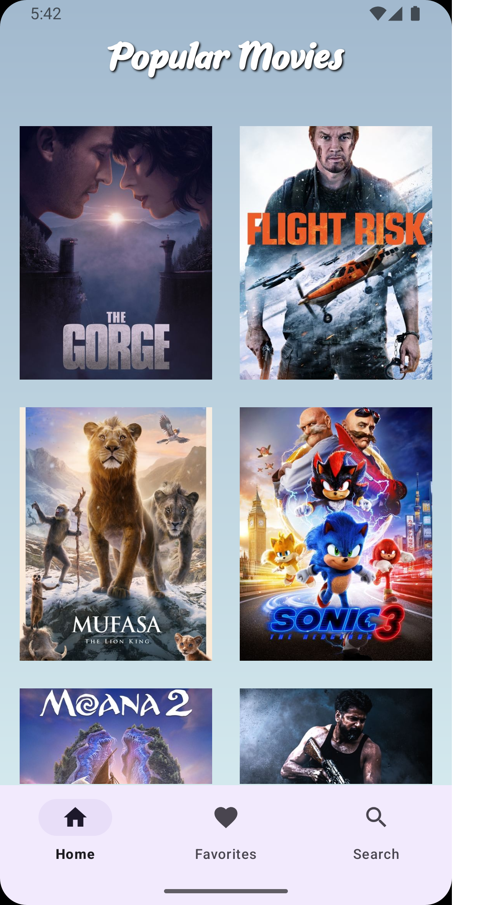
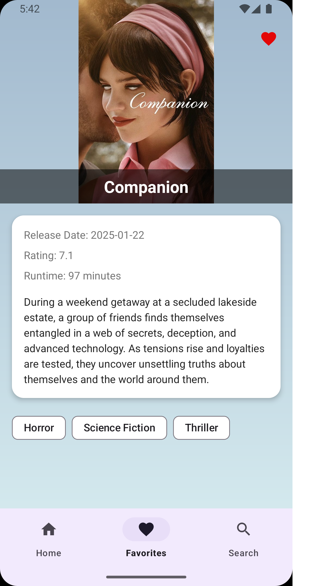
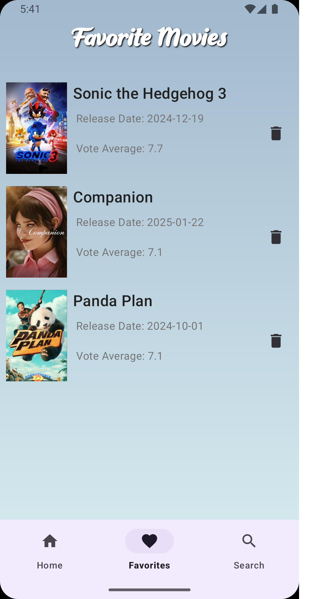
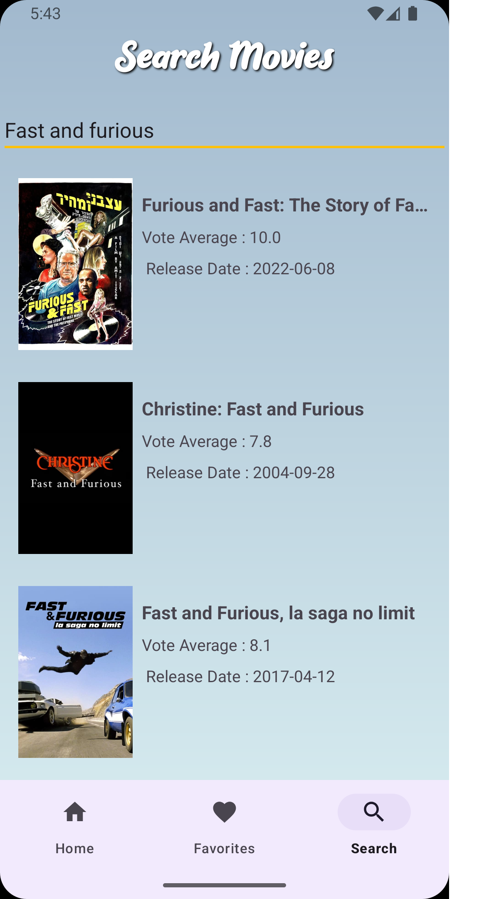

# 🎬 MovieTracker

MovieTracker, kullanıcıların film araması yapabildiği, detaylarını görebildiği ve favorilere ekleyebildiği bir mobil uygulamadır.

## 🚀 Kullanılan Teknolojiler
- Kotlin
- Coroutines
- Retrofit
- TMDB API
- Room Database
- MVVM Architecture

## 📸 Ekran Görüntüleri  
Aşağıda uygulamanın bazı ekran görüntülerini bulabilirsiniz:

## Kurulum
1. Projeyi klonla
2. Android Studio ile aç
3. TMDB API Key ekle
4. Çalıştır 🚀